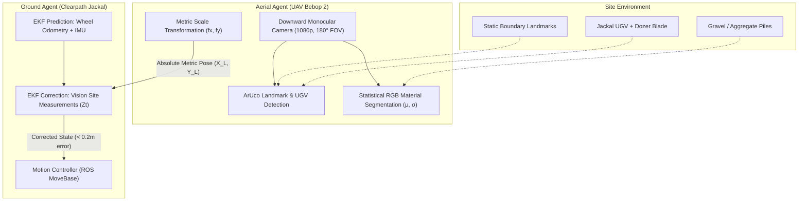

# Paper Review: Vision-Based UAV-UGV Collaboration for Autonomous Construction Site Preparation

**Citation**:  
Oren Elmakis, Tom Shaked, and Amir Degani, *"Vision-Based UAV-UGV Collaboration for Autonomous Construction Site Preparation,"* **IEEE Access**, vol. 10, pp. 51209–51220, April 2022.  
DOI: [10.1109/ACCESS.2022.3170408](https://doi.org/10.1109/ACCESS.2022.3170408)  
Local Resource: [`Vision-Based_UAV-UGV_Collaboration_for_Autonomous_Construction_Site_Preparation.pdf`](file:///home/prem/terralink/docs/resource/Vision-Based_UAV-UGV_Collaboration_for_Autonomous_Construction_Site_Preparation.pdf)

---

## 1. Executive Summary & Core Objective

The paper tackles the challenge of **autonomous preliminary construction site preparation** (debris clearing, earthmoving, material leveling, soil stabilization) in unstructured, GPS-degraded, and dynamically changing outdoor environments.

Traditional construction tasks rely on heavy machinery (bulldozers, excavators) operated by skilled labor. While static indoor environments have seen rapid robotic adoption, outdoor construction sites introduce severe hurdles:
1. **Unstructured & Dynamic Topography**: Earthmoving, excavation, and pushing gravel actively reshape the environment, rendering pre-computed or offline static maps (e.g., standard AMCL or satellite orthomosaics) invalid.
2. **Severe Odometry Degradation**: Wheel encoders on skid-steer or wheeled platforms suffer massive cumulative drift due to wheel slip, sinkage, and resistance when pushing granular materials. Onboard visual odometry fails during sharp turns, vibrations, and featureless terrain.
3. **Limited Ground Perspective**: A UGV's forward-facing sensors have restricted field-of-view (FOV) and are heavily occluded by mounds, debris, or the vehicle's own blade/shovel.

**The Authors' Solution**:  
A heterogeneous cooperative team consisting of:
- An **Unmanned Aerial Vehicle (UAV)** (Parrot Bebop 2) providing a wide, downward-looking overhead perspective ("eyes in the sky").
- An **Unmanned Ground Vehicle (UGV)** (Clearpath Jackal with custom 40×50 cm dozer blade) performing heavy earthmoving.
- A central CAD/computational framework (**Shepherd**, a custom Rhinoceros 3D / Grasshopper visual programming plugin) managing parametric path generation and mission supervisory control.

---

## 2. Key Methodological Innovations

### 2.1 Invariant Metric Site Localization via Static Landmarks

Rather than relying on noisy UAV GPS or complex visual-inertial SLAM for the drone, the authors use **static planar landmarks** (ArUco markers) placed at known boundary positions in the site, alongside a marker mounted on top of the UGV.

1. **Scale Factor Derivation**:  
   Given two static landmarks $l_i, l_j$ with known local site coordinates $(X_{L,l_i}, Y_{L,l_i})$ and measured camera image pixel coordinates $(x_{L,l_i}, y_{L,l_i})$:
   $$f_X = \frac{X_{L,l_i} - X_{L,l_j}}{x_{L,l_i} - x_{L,l_j}}, \quad f_Y = \frac{Y_{L,l_i} - Y_{L,l_j}}{y_{L,l_i} - y_{L,l_j}}$$

2. **Metric UGV Position Calculation**:  
   The metric location of the UGV $(X_L, Y_L)$ relative to reference landmark $l_i$ is computed as:
   $$X_L = (x_{UGV} - x_{L,l_i}) f_X, \quad Y_L = (y_{UGV} - y_{L,l_i}) f_Y$$

**Crucial Insight**:  
Because the measurement is calculated **strictly relative to static ground landmarks appearing in the same camera frame**, the resulting metric pose is **completely invariant to UAV drift, altitude oscillations, or wind perturbations**. As long as the landmarks and UGV remain within the camera FOV, the position measurement remains drift-free.

---

### 2.2 Collaborative Extended Kalman Filter (EKF) State Estimation

To combine high-rate onboard dead-reckoning with drift-free overhead vision, the UGV runs an Extended Kalman Filter:

#### A. Prediction Step (Onboard Dynamics)
Using the nonlinear kinematic model of the skid-steer vehicle:
$$x_t = f(u_t, x_{t-1}) + \omega_t, \quad \omega_t \sim \mathcal{N}(0, Q_t)$$
$$\hat{x}_{t|t-1} = f(\hat{x}_{t-1|t-1}, u_t)$$
$$\Sigma_{t|t-1} = G_{t-1} \Sigma_{t-1|t-1} G_{t-1}^T + R_t$$
where $G_{t-1} = \left.\frac{\partial f}{\partial x}\right|_{\hat{x}_{t-1|t-1}, u_t}$ is the state transition Jacobian.

#### B. Correction Step (Aerial Vision Updates)
When the UAV detects the UGV and landmarks, it transmits measurement $z_t = [X_L, Y_L]^T$:
$$z_t = h(x_t) + e_t, \quad e_t \sim \mathcal{N}(0, R_T)$$
$$K_t = \Sigma_{t|t-1} H_t^T \left( H_t \Sigma_{t|t-1} H_t^T + Q_t \right)^{-1}$$
$$\hat{x}_{t|t} = \hat{x}_{t|t-1} + K_t \left( z_t - h(\hat{x}_{t|t-1}) \right)$$
$$\Sigma_{t|t} = (I - K_t H_t) \Sigma_{t|t-1}$$

#### Empirical Results
- **Baseline EKF (Wheel Odom + IMU only)**: Severely diverged. Wheel slip during dozer operations and skid steering produced large heading errors and path length misestimations (> 1.5–2.0 m error within tens of seconds).
- **Collaborative Vision EKF**: Bound maximum localization error to **$< 0.2\text{ m}$** consistently across all trials (Slalom, Spiral, and Fork trajectories).

---

### 2.3 Online Adaptive Material Mapping

The authors model material dispersion (gravel piles) using a fast statistical color model in RGB color space:
1. Operator samples an initial bounding box $O_{\text{User}}$ containing gravel.
2. The color distribution is modeled as a Gaussian $\mathcal{N}(\vec{\mu}, \vec{\sigma}^2)$:
   $$\vec{\mu} = \frac{1}{n} \sum_{i=1}^n \vec{RGB}_i, \quad \vec{\sigma} = \sqrt{\frac{1}{n} \sum_{i=1}^n (\vec{RGB}_i - \vec{\mu})^2}$$
3. Online frames are segmented into a binary occupancy grid using threshold bands $[\vec{\mu} - k_{\text{low}}\vec{\sigma}, \; \vec{\mu} + k_{\text{high}}\vec{\sigma}]$.
4. As the UGV pushes material, the binary grid updates online, providing real-time feedback on site grading and pile dispersion.

---

### 2.4 Trajectory Generation & Execution Architecture

1. Trajectories are parameterized in CAD (Shepherd / Grasshopper) as continuous curves:
   - **Slalom**: Smooth continuous curves with moderate turning.
   - **Spiral**: Inward sweeping with variable curvature.
   - **Fork**: Interleaved pushing passes requiring repeated sharp turns in place.
2. Curves are discretized into ordered waypoint lists $(x_k, y_k)$.
3. Waypoints are dispatched to the robot using ROS **MoveBase**.
4. The robot advances to waypoint $k+1$ when its estimated position enters a predefined acceptance radius around waypoint $k$.

---

## 3. Comparison with TerraLink Architecture

| Feature | Elmakis et al. (2022) | TerraLink (`emap` + `nav`) |
| :--- | :--- | :--- |
| **Primary Domain** | Open outdoor construction site preparation | Occluded, unstructured multi-room & tunnel environments |
| **Aerial Sensor** | 2D Monocular Downward Camera (1080p) | 3D RGB-D Depth Camera (Point Cloud, 10 Hz) |
| **Terrain Representation** | 2D Binary Material Grid (Statistical RGB) | 2.5D Elevation GridMap (`emap`) + Bounded 3D Voxel Octree (`nav`) |
| **Occlusion Handling** | Assumes open sky; cannot see under roofs/overhangs | **Hybrid 2.5D + Bounded 3D**: Anomaly detection + volumetric headroom check |
| **Localization Method** | Overhead vision + ArUco landmarks $\to$ EKF correction | TF tree + Ignition Ground Truth / OdometryPublisher |
| **Path Planning** | Pre-designed parametric geometric curves (Shepherd CAD) | Online PRM on traversability & anomaly costmaps |
| **Execution Controller** | ROS 1 MoveBase (Trajectory Planner) | ROS 2 Nav2 (DWB Controller + Waypoint Follower) |

---

## 4. Key Takeaways & Lessons for TerraLink

1. **Decoupled Metric Ground Referencing Prevents Drift**:
   Elmakis et al. achieved rock-solid $< 0.2\text{ m}$ localization by calculating scale and offsets relative to static features. In TerraLink, our TF trees between `iris_quad/odom` and `nav_ugv/odom` serve a similar global anchoring role, but we lack ground-level visual anchoring when the UGV is inside occluded structures.
2. **Trajectory Smoothness is Paramount for Ground Execution**:
   In Elmakis et al., paths are generated from smooth mathematical curves (splines, spirals) in CAD, avoiding abrupt sharp angle changes. TerraLink's PRM currently produces jagged, sharp-cornered random waypoints, which severely punishes ground controllers.
3. **The Waypoint-Pumping Trap**:
   Elmakis et al. noted that using discrete waypoints with stop-and-go checks increases task execution time. Their future work explicitly recommended continuous trajectory tracking. TerraLink suffers from this exact pathology in its `/goal_pose` bridge.
4. **Adaptive Active Perception**:
   Elmakis et al. acknowledged that a static overhead camera is limited to a small arena ($3.6 \times 5\text{ m}$). Moving the UAV intelligently ("smart camera" path planning) to actively inspect the UGV's forward path is essential for scaling to larger sites. In TerraLink, having the UAV fly directly to the tunnel entrance rather than completing arbitrary room orbits will drastically cut mapping latency.
