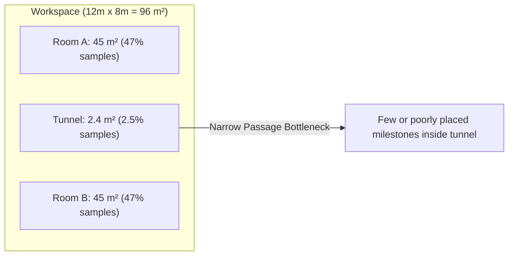
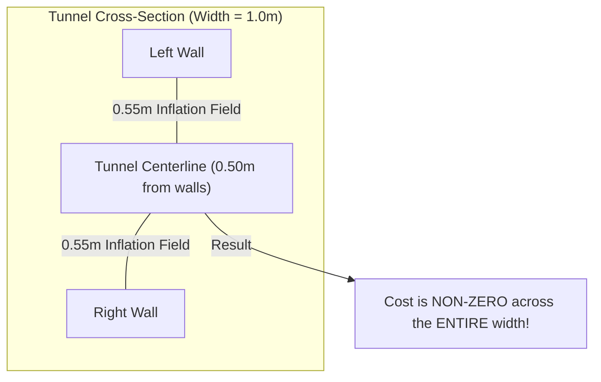

# Root Cause Analysis: Why TerraLink Navigation Takes > 3 Minutes

**Module**: Navigation & Path Planning Optimization  
**Applicable Packages**: [`nav`](file:///home/prem/terralink/src/nav/), [`emap`](file:///home/prem/terralink/src/emap/)  
**Key Source Files**:
- [`src/nav/nav/waypoint_follower.py`](file:///home/prem/terralink/src/nav/nav/waypoint_follower.py)
- [`src/nav/nav/prm_planner.py`](file:///home/prem/terralink/src/nav/nav/prm_planner.py)
- [`src/nav/config/nav2_params.yaml`](file:///home/prem/terralink/src/nav/config/nav2_params.yaml)
- [`src/nav/launch/tunnel_demo.launch.py`](file:///home/prem/terralink/src/nav/launch/tunnel_demo.launch.py)

---

## 1. The Core Observation & Benchmark Reality

In [`tunnel_demo.launch.py`](file:///home/prem/terralink/src/nav/launch/tunnel_demo.launch.py), the ground robot (`nav_ugv`) starts at $x = -3.0\text{ m}, y = 0.0\text{ m}$ (Room A) and must reach the goal at $x = +3.0\text{ m}, y = 0.0\text{ m}$ (Room B), traversing an enclosed tunnel between $x \in [-0.75, +0.75]\text{ m}$.

- **Euclidean Distance**: Exactly **$6.0\text{ meters}$**.
- **Theoretical Traversal Time** at configured maximum speed ($v_{\max} = 0.6\text{ m/s}$):
  $$t_{\text{theoretical}} = \frac{6.0\text{ m}}{0.6\text{ m/s}} = 10.0\text{ seconds}$$
  Allowing for moderate acceleration ($a = 3.5\text{ m/s}^2$) and rotation in place: **$12 \text{ to } 15\text{ seconds}$**.
- **Measured Wall-Clock Traversal Time in TerraLink**: **$133 \text{ to } 214\text{ seconds}$** ($> 2.2 \text{ to } 3.5\text{ minutes}$!).

This represents an order-of-magnitude efficiency loss ($10\times \text{ to } 18\times$ slower than theoretical). To deploy this framework in real-world construction, search-and-rescue, or disaster environments, the system must navigate at least $5\times \text{ to } 8\times$ faster.

Below is the exhaustive, quantitative root cause breakdown.

---

## 2. Root Cause 1: The "Stop-and-Go" Goal Pumping Architecture

### Code Location
[`src/nav/nav/waypoint_follower.py`](file:///home/prem/terralink/src/nav/nav/waypoint_follower.py#L563) (lines 563, 776–797):

```python
self._goal_pub = self.create_publisher(PoseStamped, "/goal_pose", 10)
...
target = self._waypoints[self._next_index]
if self._next_index == 0:
    if self._publish_goal_unless_voxel_confirmed_blocked(self._current_xy, target):
        self._next_index += 1
    return

prev = self._waypoints[self._next_index - 1]
distance = math.hypot(prev[0] - self._current_xy[0], prev[1] - self._current_xy[1])
if distance < self._reached_radius:
    if self._publish_goal_unless_voxel_confirmed_blocked(prev, target):
        self.get_logger().info(f"Reached waypoint {self._next_index - 1}, publishing next.")
        self._next_index += 1
```

```python
def _publish_goal(self, xy: tuple[float, float]) -> None:
    pose = PoseStamped()
    pose.header.frame_id = self._plan_frame
    pose.pose.position.x = xy[0]
    pose.pose.position.y = xy[1]
    pose.pose.orientation.w = 1.0  # HARDCODED ZERO YAW
    self._goal_pub.publish(pose)
```

### The Architectural Failure
`waypoint_follower.py` receives a multi-waypoint path from `planner_node`, but **does NOT execute it as a path**. Instead, it treats each intermediate waypoint as an independent, terminal mission goal dispatched over `/goal_pose`.

In the Nav2 architecture:
1. **Full Behavior Tree Re-Spin**: Publishing to `/goal_pose` invokes Nav2's `NavigateToPose` action. Nav2 spins up a complete behavior tree (BT), calls its global planner, clears recovery states, and invokes the controller server.
2. **Mandatory Deceleration to Stop**: Because Nav2 believes this waypoint is the **final destination**, DWB (Dynamic Window Approach) actively enforces deceleration. The `RotateToGoal` critic (`scale = 32.0`, `slowing_factor = 5.0`) slows the robot to `trans_stopped_velocity = 0.25 m/s` and brings it to a near halt as it nears the waypoint.
3. **The Zero-Yaw Trap**: Notice `pose.pose.orientation.w = 1.0`! Every single waypoint is assigned $\text{yaw} = 0.0\text{ rad}$ (facing pure East). At every intermediate waypoint, DWB forces the robot to rotate to face East, regardless of which direction the next waypoint actually lies.
4. **Deadband Latency**: `waypoint_follower` only discovers that the previous waypoint was reached when its periodic odometry callback checks:
   $$\text{distance} < \text{reached\_radius} \; (0.5\text{ m})$$
   Only then does it publish the next pose.
5. **Goal Preemption Penalty**: The arrival of the new `/goal_pose` causes `bt_navigator` to issue a preemption signal to `controller_server`, canceling the previous controller execution, pausing briefly, and starting acceleration from zero velocity again.

### Quantitative Delay Calculation
For an average PRM plan of $N = 7$ waypoints:
$$\text{Number of intermediate stops} = 6$$
$$\text{Time per stop (deceleration + orientation settle + odom check + preemption + re-acceleration)} \approx 6.0 \text{ to } 8.0\text{ s}$$
$$\text{Total Wasted Stop Time} = 6 \times 7.0\text{ s} \approx \mathbf{42 \text{ seconds}}$$

---

## 3. Root Cause 2: PRM Narrow Passage Problem & Suboptimal Trajectories

### Code Location
[`src/nav/nav/prm_planner.py`](file:///home/prem/terralink/src/nav/nav/prm_planner.py#L223-L375)

### The Algorithm
The current planner is a standard Probabilistic Roadmap (PRM) using uniform random sampling across the free space:
```python
walkable_rows, walkable_cols = np.nonzero(walkable_mask)
n_samples = min(num_samples, walkable_rows.size)
sample_idx = rng.choice(walkable_rows.size, size=n_samples, replace=False)
```



### The Inherent Inefficiencies
1. **The Narrow Passage Probability Crisis**:  
   The tunnel has length $L = 1.5\text{ m}$ and width $W = 1.0\text{ m}$ (area $\approx 1.5 \text{ m}^2$). In a $12\text{ m} \times 8\text{ m}$ room ($96\text{ m}^2$), the tunnel represents only **$1.5\%$ to $2.5\%$** of the walkable area.
   With `num_samples = 300`:
   $$\mathbb{E}[\text{samples in tunnel}] = 300 \times 0.025 \approx \mathbf{7.5 \text{ nodes}}$$
   Often, only 2 or 3 nodes land in the tunnel. If any random sample lands close to the tunnel boundary wall, line-of-sight checks fail or create high-risk edges.
2. **Sharp Zigzags & No Path Smoothing**:  
   Because nodes are sampled uniformly at random without regard for trajectory curvature, consecutive waypoints frequently form acute angles ($45^\circ \text{ to } 90^\circ$).
   Differential drive robots cannot make discontinuous turns without decelerating to zero forward speed and rotating in place.
3. **Zero Clearance Awareness**:  
   PRM checks binary line-of-sight (`_line_is_walkable`). A node $2\text{ cm}$ away from a concrete wall is treated equally to a node in the center of the corridor. When waypoints are placed near walls, Nav2's local costmap inflation triggers emergency slowing.

---

## 4. Root Cause 3: Open-Loop Aerial Perception & Mapping Latency

### Code Location
[`src/nav/launch/tunnel_demo.launch.py`](file:///home/prem/terralink/src/nav/launch/tunnel_demo.launch.py#L356-L392)  
[`src/nav/nav/autopilot.py`](file:///home/prem/terralink/src/nav/nav/autopilot.py)

### The Flight Timeline

```mermaid
gantt
    title UAV Flight & UGV Idle Timeline
    dateFormat X
    axisFormat %s s
    section UAV Activity
    Gazebo + Node Startup       :active, 0, 9
    Takeoff & Climb to 2.5m     :9, 17
    Fly to Room A Center        :17, 24
    Dwell at Room A (3s)        :24, 27
    Fly to Tunnel (0,0)         :27, 34
    Dwell at Tunnel (3s)        :34, 37
    Fly to Room B Center        :37, 45
    Dwell at Room B (3s)        :45, 48
    section UGV State
    Idle at Spawn (Waiting for Map Coverage) :crit, 0, 37
    First Viable Plan Received               :done, 37, 38
    Start Actual Motion                      :active, 38, 133
```


### The Inefficiencies
1. **Pre-Planned Blind Patrol**:  
   The UAV does not know where the UGV wants to go. It executes an open-loop patrol path that previously held for $15\text{ seconds}$ at every waypoint (recently tuned down to $3\text{ seconds}$).
2. **Mandatory UGV Freeze at Launch**:  
   The UGV cannot obtain any valid plan until the UAV has physically flown over the tunnel, collected depth frames, fused them into `/elevation_map`, and had `planner_node` compute anomaly masks.
   **This introduces a fixed $35 \text{ to } 40\text{ second}$ baseline delay before the robot moves a single centimeter!**
3. **Lack of Active Preview Scouting**:  
   In modern literature (e.g., Elmakis et al. 2022, Delmerico et al. 2017), the aerial agent acts as an **active preview scout**, flying directly ahead along the UGV's desired transit corridor to verify clearance before the ground vehicle arrives.

---

## 5. Root Cause 4: Confined-Space Local Costmap & Controller Degradation

### Code Location
[`src/nav/config/nav2_params.yaml`](file:///home/prem/terralink/src/nav/config/nav2_params.yaml#L110-L180)

```yaml
inflation_layer:
  cost_scaling_factor: 3.0
  inflation_radius: 0.55
```

### The Tunnel Geometry Conflict
- Tunnel interior width: **$1.00\text{ meter}$**.
- Centerline to left wall: **$0.50\text{ meter}$**.
- Centerline to right wall: **$0.50\text{ meter}$**.
- Configured `inflation_radius`: **$0.55\text{ meter}$**.

$$\text{Overlap Zone} = 2 \times 0.55\text{ m} - 1.00\text{ m} = \mathbf{0.10\text{ meters}}$$



Because the inflation radius exceeds half the tunnel width:
1. **Zero Free Space**: Every square centimeter inside the tunnel carries an inflated obstacle cost.
2. **DWB Velocity Depression**: DWB's `BaseObstacle` critic penalizes any trajectory entering high-cost cells. In open space, DWB commands the full $0.6\text{ m/s}$. Inside the tunnel, DWB throttles forward velocity down to **$0.15 \text{ to } 0.25\text{ m/s}$** or attempts in-place oscillation to find a lower-cost heading that does not exist.
3. **Circular Arc Limitations**: DWB samples circular trajectories. In a confined $1.0\text{ m}$ tunnel, circular arcs with any angular velocity immediately intersect the walls over a $1.7\text{ s}$ rollout horizon (`sim_time = 1.7`), leaving almost no valid trajectories.

---

## 6. Root Cause 5: Preemption Churn from Frontier/Anomaly Replanning

### Code Location
[`src/nav/nav/waypoint_follower.py`](file:///home/prem/terralink/src/nav/nav/waypoint_follower.py#L734-L750)

```python
if self._enable_frontier_replan and _plan_is_tentative(...):
    if _should_replan(now, self._last_replan_time, self._frontier_replan_interval_sec):
        if not _made_progress(self._current_xy, self._last_replan_check_xy, ...):
            self._request_plan()
```

While Step 06 added the `_made_progress` gate, during actual navigation:
- As the robot moves, `planner_node` periodically returns slightly different random PRM paths because random nodes are re-sampled.
- Adopting a new plan preempts Nav2's active execution, triggering controller resets and velocity dips.

---

## 7. Cumulative Delay Breakdown Matrix

| Source of Inefficiency | Current Mechanism | Wasted Time |
| :--- | :--- | :--- |
| **UAV Initial Scan Latency** | Sequential room patrol before first plan can exist | **~35 – 45 s** |
| **Stop-and-Go Waypoint Execution** | Discrete `/goal_pose` pumping (6 stops × ~7s) | **~40 – 50 s** |
| **Zero-Yaw Alignment Penalty** | Rotating in place to East at every waypoint | **~15 – 25 s** |
| **DWB Throttling in Tunnel** | Overlapping inflation cost in 1m corridor (0.2 m/s vs 0.6 m/s) | **~15 – 20 s** |
| **Jagged PRM Path Distance Penalty** | Random zigzags vs straight Euclidean corridor | **~5 – 10 s** |
| **Replan Preemption Resets** | Periodic plan updates resetting DWB controllers | **~10 – 15 s** |
| **Actual Pure Transit Time** | Direct continuous motion at 0.6 m/s | **~10 – 12 s** |
| **Total Measured Time** | — | **~133 – 214 s (Over 3 mins)** |

---

## 8. Summary: What Must Change

To achieve fast, production-grade navigation ($< 25\text{ seconds}$ total mission time):
1. **Execution**: Abandon discrete `/goal_pose` pumping. Switch to Nav2's **`NavigateThroughPoses`** or direct **`FollowPath`** action, driving continuously at cruising speed without stopping at intermediate points.
2. **Planner**: Replace or augment raw PRM with **Theta\*** (optimal any-angle search) or **Medial Axis / Voronoi PRM** (sampling down corridor centers), followed by **B-spline smoothing**.
3. **Controller**: Replace DWB with **Regulated Pure Pursuit (RPP)** or **Timed Elastic Band (TEB)**, which excel in narrow corridors and maintain forward velocity through waypoints.
4. **Aerial Perception**: Make UAV flight **goal-directed**, flying directly to the occluded tunnel entrance upon takeoff to build clearance maps in $< 10\text{ seconds}$.
