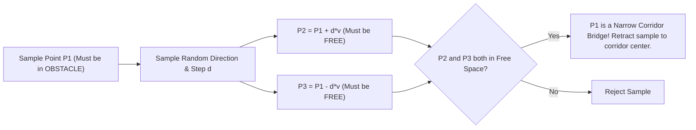
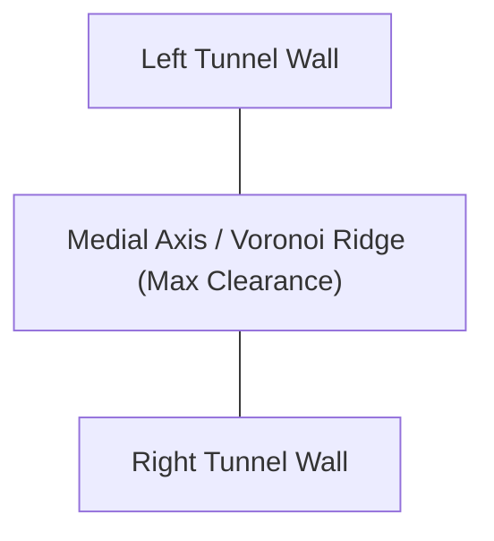
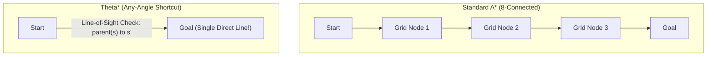

# Literature Review: Narrow Passages, Any-Angle Planning, and Subterranean Navigation

**Topic**: State-of-the-Art Motion Planning for Constrained, Narrow, and Occluded Environments  
**Relevance to TerraLink**: Directly resolves the inefficiencies identified in [`prm_planner.py`](file:///home/prem/terralink/src/nav/nav/prm_planner.py) and tunnel traversal bottlenecks.

---

## 1. The Narrow Passage Problem in Sampling-Based Planning

### 1.1 Theoretical Foundation: The Measure Problem
In classical Probabilistic Roadmaps (PRM, Kavraki et al., 1996), nodes are sampled uniformly at random from configuration space $\mathcal{C}$. The probability of placing a milestone inside a corridor $\mathcal{P} \subset \mathcal{C}_{\text{free}}$ is strictly proportional to its relative volume (Lebesgue measure):

$$P(q \in \mathcal{P}) = \frac{\mu(\mathcal{P})}{\mu(\mathcal{C}_{\text{free}})}$$

For a narrow tunnel of width $w$ and length $L$ in an environment of diameter $D$, the volume ratio scales as $(w/D)^{d-1}$ where $d$ is the dimensionality. As $w \ll D$:
$$P(q \in \mathcal{P}) \to 0$$

Furthermore, connecting two nodes $q_1, q_2 \in \mathcal{P}$ requires that the straight line $\overline{q_1 q_2}$ does not touch the corridor walls. As the distance between samples increases, the probability of straight-line collision-free connection decays exponentially.

---

### 1.2 Bridge Test Sampling (Hsu et al., 2003)
**Citation**: D. Hsu, T. Jiang, J. H. Reif, and Z. Sun, *"The bridge test for sampling narrow passages with probabilistic roadmap planners,"* in *Proc. IEEE Int. Conf. Robotics and Automation (ICRA)*, 2003.



#### The Bridge Algorithm:
1. Pick a random configuration $p_1 \in \mathcal{C}_{\text{obs}}$ (inside an obstacle!).
2. Pick a random direction vector $v$ with magnitude $d$ drawn from a Gaussian $\mathcal{N}(0, \sigma^2)$, where $\sigma$ matches the expected passage width.
3. Compute two test endpoints:
   $$p_2 = p_1 + d \cdot v, \quad p_3 = p_1 - d \cdot v$$
4. **Condition**: If both $p_2 \in \mathcal{C}_{\text{free}}$ and $p_3 \in \mathcal{C}_{\text{free}}$, then $p_1$ lies directly in an obstacle wall separating two free regions—or, inversely, $p_1$ identifies a narrow neck. Placing a milestone at the midpoint or retracting to the passage center populates narrow corridors with high density while ignoring vast empty rooms.

---

### 1.3 Medial Axis PRM (MAPRM) & Voronoi Roadmaps
**Citation**: S. A. Wilmarth, N. M. Amato, and P. F. Stiller, *"MAPRM: A probabilistic roadmap planner with sampling on the medial axis of the free space,"* in *Proc. IEEE Int. Conf. Robotics and Automation (ICRA)*, 1999.

#### Theoretical Formulation:
The **Medial Axis** $\mathcal{M}(\mathcal{C}_{\text{free}})$ is the set of all points in free space having at least two distinct closest points on the obstacle boundary $\partial \mathcal{C}_{\text{free}}$:
$$\mathcal{M}(\mathcal{C}_{\text{free}}) = \{ q \in \mathcal{C}_{\text{free}} \mid \exists p_1, p_2 \in \partial \mathcal{C}_{\text{free}}, \; p_1 \neq p_2, \; \|q - p_1\| = \|q - p_2\| = \text{dist}(q, \partial \mathcal{C}_{\text{free}}) \}$$



#### Why MAPRM Solves Tunnel Navigation:
1. **Maximal Clearance**: Paths along the medial axis naturally maximize distance from surrounding walls:
   $$\max_{q \in \mathcal{P}} \text{dist}(q, \text{Obstacles})$$
2. **Deterministic Corridor Routing**: The medial axis forms a continuous 1D skeleton through the center of every tunnel, eliminating random zigzagging.
3. **No Costmap Inflation Overlap**: By following the medial axis, the robot stays exactly at $0.50\text{ m}$ from both tunnel walls, keeping costmap inflation penalties at their absolute minimum.

---

## 2. Search-Based Any-Angle Planners (The Deterministic Alternative)

Rather than probabilistic sampling (which introduces randomness, unpredictable latency, and zigzag edges), modern mobile robotics relies heavily on **Any-Angle Search-Based Planners** executed directly on 2D/2.5D costmaps.

### 2.1 Theta\* and Lazy Theta\* (Nash et al., 2007, 2010)
**Citation**: A. Nash, K. Daniel, S. Koenig, and A. Felner, *"Theta\*: Any-angle path planning on grids,"* in *Proc. AAAI Conf. Artificial Intelligence*, 2007.

Standard A\* restricts movement to 4 or 8 grid neighbors, producing artificial heading changes and paths up to $\approx 8\%$ longer than Euclidean distance (the "grid digitizing artifact").



#### The Theta\* Algorithmic Innovation (Line-of-Sight Parent Pointer):
In standard A\*, the parent of successor $s'$ is always the expanding node $s$:
$$\text{parent}(s') = s$$

In **Theta\***, the algorithm checks if a collision-free straight line of sight exists between $\text{parent}(s)$ and $s'$:
```python
if line_of_sight(parent(s), s'):
    # Path 2: Shortcut directly from parent of s
    if g(parent(s)) + c(parent(s), s') < g(s'):
        parent(s') = parent(s)
        g(s') = g(parent(s)) + c(parent(s), s')
else:
    # Path 1: Standard A* update
    if g(s) + c(s, s') < g(s'):
        parent(s') = s
        g(s') = g(s) + c(s, s')
```

#### Benchmarks against PRM:
- **Runtime**: **$2 \text{ to } 5\text{ milliseconds}$** on a $200 \times 200$ grid (versus 50–150 ms for PRM graph construction).
- **Path Length**: Mathematically bounded within $\epsilon$ of true Euclidean shortest path.
- **Smoothness**: Eliminates all redundant waypoints; a straight corridor produces exactly **2 waypoints** (entrance and exit) connected by a single vector!

---

### 2.2 Hybrid A\* for Non-Holonomic Vehicles (Dolgov et al., 2010)
**Citation**: D. Dolgov, S. Thrun, M. Montemerlo, and M. Diebel, *"Path planning for autonomous driving in unknown environments,"* *Int. J. Robotics Research (IJRR)*, vol. 29, no. 5, pp. 485–501, 2010.

For ground vehicles with kinematic turning constraints:
1. **Continuous Coordinates**: Operates on continuous $(x, y, \theta)$ states while using discrete grid cells for search pruning.
2. **Kinodynamic Node Expansion**: Successor states are generated using vehicle steering and forward/reverse primitive curves (Dubins or Reeds-Shepp paths).
3. **Analytic Expansions**: Uses Reed-Shepp curves to connect candidate states directly to the goal whenever line-of-sight clearance allows.
4. **Nonlinear Path Smoothing**: Post-processes the discrete path via conjugate gradient optimization minimizing a combined cost function:
   $$J = w_{\text{smooth}} \int \|\kappa(s)\|^2 ds + w_{\text{obstacle}} \int \sigma(\text{dist}(s)) ds + w_{\text{curvature}} \int \max(0, |\kappa(s)| - \kappa_{\max})^2 ds$$

---

## 3. Subterranean & Occluded Navigation: Lessons from the DARPA SubT Challenge

The DARPA Subterranean (SubT) Challenge (2018–2021) forced global robotics teams to solve autonomous navigation in complex underground tunnels, mines, and caves.

### 3.1 Team CERBERUS: Hierarchical Dual-Layer Graph Planning
**Citation**: M. Tranzatto et al., *"CERBERUS: Autonomous exploration for subterranean environments,"* *Science Robotics*, vol. 7, no. 66, 2022.

CERBERUS deployed heterogeneous quadrupeds (ANYmal) and aerial drones (RMF-Owl). Their planning architecture separated navigation into:
1. **Global Frontier Roadmap**: A sparse, topological graph updated at low frequency ($0.5\text{ Hz}$) connecting major rooms and intersections.
2. **Local Volumetric Motion Planning**: High-rate ($10 \text{ to } 20\text{ Hz}$) sampling inside a local TSDF / OctoMap bounding box.
3. **Corridor Centering Behavior**: Inside narrow mine tunnels, the planner dynamically activates a medial-axis potential field that pushes the robot toward the geometric center of the passage, preventing collision-checking churn near rough rock walls.

### 3.2 Team CoSTAR: Risk-Aware Corridor Traversal (NeBula)
**Citation**: A. Agha et al., *"NeBula: Quest for robotic autonomy in challenging environments,"* *J. Field Robotics*, vol. 38, no. 8, pp. 1076–1110, 2021.

CoSTAR used **Belief-Space Planning** under localization and mapping uncertainty:
- **Tunnel Funneling**: When approaching an occluded passage or culvert, the vehicle slows down, narrows its local costmap footprint tolerance, aligns its heading with the tunnel vector *before* entering, and executes a continuous feedforward velocity burst through the passage.

---

## 4. Trajectory Optimization: Timed Elastic Band (TEB)

**Citation**: C. Rösmann, W. Feiten, T. Wösch, F. Hoffmann, and T. Bertram, *"Trajectory modification using Timed Elastic Bands with obstacle avoidance,"* in *Proc. IEEE/RSJ Int. Conf. Intelligent Robots and Systems (IROS)*, 2012.

Instead of evaluating discrete forward arcs (like DWB), the **Timed Elastic Band (TEB)** optimizes a trajectory represented as an elastic band of poses $s_i = (x_i, y_i, \theta_i)$ and time differences $\Delta t_i$:

$$B = (s_0, \Delta t_0, s_1, \Delta t_1, \dots, s_n)$$

The trajectory is deformed in real time by solving a sparse nonlinear program (via g2o / Ceres):
$$\min_{B} \sum_{k} \left[ w_{\text{time}} \Delta t_k^2 + w_{\text{obs}} f_{\text{obs}}(s_k) + w_{\text{kin}} f_{\text{kin}}(s_k, s_{k+1}, \Delta t_k) + w_{\text{acc}} f_{\text{acc}}(s_k, s_{k+1}, s_{k+2}) \right]$$

### Why TEB Outperforms DWB in Tunnels:
1. **Continuous Forward Drive**: TEB maintains velocity through waypoints, never coming to an intermediate halt.
2. **Deformation Away from Walls**: Obstacle repulsive forces dynamically push the trajectory nodes toward the tunnel centerline.
3. **Time-Optimality**: The objective function $\sum \Delta t_k^2$ actively penalizes slow transit, maximizing speed up to physical robot acceleration limits.

---

## 5. Comparative Assessment Matrix for TerraLink

| Planning Paradigm | Optimality | Narrow Passage Reliability | Execution Smoothness | Computational Cost | Recommended for TerraLink? |
| :--- | :--- | :--- | :--- | :--- | :--- |
| **Uniform PRM** *(Current)* | Probabilistic | **Extremely Poor** ($P \ll 1$) | Discontinuous zigzags | Medium (~50–150 ms) | ❌ **Replace or Augment** |
| **Bridge Test PRM** | Probabilistic | **High** in narrow necks | Moderate | Medium (~60–100 ms) | ⚠️ Viable sampling patch |
| **Medial Axis PRM (MAPRM)** | Near-Optimal Clearance | **Excellent** (Centered) | High clearance, smooth | Medium (~80–120 ms) | ✅ **Strong Candidate** |
| **Theta\* / Lazy Theta\*** | Euclidean Optimal | **Guaranteed** (Grid complete) | **Direct Straight Lines** | **Ultra-Low (< 5 ms)** | ⭐ **Top Recommendation** |
| **DWB Local Controller** *(Current)* | Discrete heuristic | Fails in $< 1.1\text{m}$ corridors | Stop-and-go stutter | Low | ❌ **Replace with RPP/TEB** |
| **Regulated Pure Pursuit (RPP)** | Path-exact | **Flawless** in corridors | **Continuous cruising** | **Ultra-Low (< 1 ms)** | ⭐ **Top Recommendation** |
| **Timed Elastic Band (TEB)** | Time-optimal | **Excellent** | Optimal deformation | Moderate (~10–20 ms) | ✅ **High Performance** |
