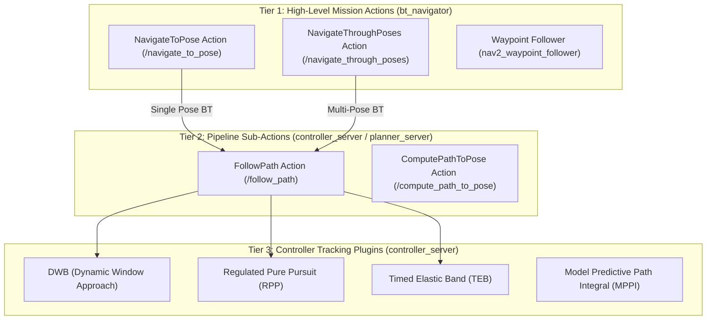
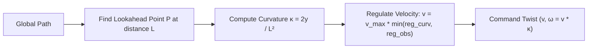

# Nav2 Trajectory Execution Architectures: Eliminating the Stop-and-Go Trap

**Topic**: High-Performance Path Following & Controller Architectures in ROS 2 Humble Nav2  
**Target Package**: [`nav`](file:///home/prem/terralink/src/nav/)  
**Direct Relevance**: Eliminates the 40–50 second delay caused by discrete `/goal_pose` waypoint pumping in [`waypoint_follower.py`](file:///home/prem/terralink/src/nav/nav/waypoint_follower.py).

---

## 1. The Architectural Hierarchy of Nav2 Execution

ROS 2 Navigation (Nav2) provides three distinct tiers for commanding motion. Selecting the incorrect tier fundamentally degrades system performance.



---

## 2. In-Depth Comparison of Execution Paradigms

### 2.1 The Current TerraLink Flaw: `NavigateToPose` Loop via `/goal_pose`
In [`waypoint_follower.py`](file:///home/prem/terralink/src/nav/nav/waypoint_follower.py#L563):
```python
self._goal_pub = self.create_publisher(PoseStamped, "/goal_pose", 10)
```
- **How it works**: Publishing to `/goal_pose` is redirected by Nav2 into a call to the `NavigateToPose` action.
- **The Execution Cycle**:
  1. `bt_navigator` creates a new behavior tree instance.
  2. The BT calls `ComputePathToPose` (global planner).
  3. The BT calls `FollowPath` for that single segment.
  4. The robot drives to the point.
  5. The controller slows to a stop (`RotateToGoal`, `trans_stopped_velocity`).
  6. The robot turns in place to align with `orientation.w = 1.0` (East).
  7. Goal success is reported to the BT.
  8. `waypoint_follower.py` detects arrival via odometry polling.
  9. Next `/goal_pose` is dispatched, preempting any lingering state and starting the cycle again from zero velocity.
- **Result**: $N$ waypoints $\implies$ $N$ full stop-and-turn events. Total speed is throttled to an average of $< 0.1\text{ m/s}$.

---

### 2.2 Paradigm 2: `NavigateThroughPoses` (Native Multi-Waypoint BT)
`NavigateThroughPoses` is an action interface specifically designed for traversing ordered lists of poses without intermediate stops:

```python
# nav2_msgs/action/NavigateThroughPoses
geometry_msgs/PoseStamped[] poses
string behavior_tree
---
std_msgs/Empty result
---
geometry_msgs/PoseStamped current_pose
builtin_interfaces/Duration navigation_time
builtin_interfaces/Duration estimated_time_remaining
int16 number_of_poses_remaining
```

#### How it works:
- Takes the complete array of waypoints `poses = [w1, w2, ..., wn]`.
- Nav2's `navigate_through_poses_w_replanning_and_recovery.xml` behavior tree computes a continuous path through all poses.
- **Intermediate Waypoints are NOT Terminal**: As the vehicle enters a configurable radius of waypoint $k$, the waypoint is popped from the queue and the vehicle proceeds directly to $k+1$ at cruising velocity.
- **Deceleration only occurs at the final destination** ($w_n$).

---

### 2.3 Paradigm 3: Direct `FollowPath` Action (Controller Level)
If our custom node ([`planner_node.py`](file:///home/prem/terralink/src/nav/nav/planner_node.py)) already computes the optimal collision-free global path, invoking `bt_navigator` to re-plan intermediate segments is redundant.

The cleanest, lowest-latency architecture is to call `controller_server`'s native action directly:

```python
# nav2_msgs/action/FollowPath
nav_msgs/Path path
string controller_id
string goal_checker_id
---
std_msgs/Empty result
---
```

#### Advantages:
1. **Zero BT Re-planning Overhead**: Eliminates all Behavior Tree ticks, costmap clearing services, and redundant global path queries.
2. **True Continuous Velocity Profile**: The local controller receives the complete `nav_msgs/Path` and computes smooth acceleration/deceleration profiles across the entire 6-meter span.
3. **Instantaneous Cancellation & Dynamic Re-feeding**: If `voxel_map_node` flags an anomaly or `ResolvedRegionStore` updates, `waypoint_follower` simply cancels the current `FollowPath` goal and sends the updated path in a single $< 5\text{ ms}$ IPC exchange.

---

## 3. Controller Plugin Analysis: Why DWB Struggles & Why RPP Excels

### 3.1 DWB (Dynamic Window Approach)
DWB forward-simulates a grid of velocity pairs $(v, \omega)$ over a fixed time horizon (`sim_time = 1.7s`), producing circular arcs.

#### Critical Vulnerabilities in Narrow Corridors:
1. **Circular Arcs Collide with Straight Walls**: In a $1.0\text{ m}$ wide tunnel with a $0.44\text{ m}$ robot, any arc with $|\omega| > 0.1\text{ rad/s}$ intersects the wall within $1.7\text{ seconds}$. DWB discards these trajectories as collisions.
2. **Heuristic Weight Battles**: DWB balances competing critics (`BaseObstacle`, `PathAlign`, `GoalAlign`, `PathDist`, `GoalDist`). In a narrow corridor where all cells carry elevated inflation cost, the critics conflict: `PathAlign` wants to follow the path, but `BaseObstacle` penalizes forward motion, causing velocity collapse.
3. **In-Place Rotation Glitches**: When close to a waypoint, `RotateToGoal` overrides forward motion, spinning the robot back and forth inside the corridor.

---

### 3.2 Regulated Pure Pursuit (RPP)
**Citation**: S. Macenski, M. Booker, and J. Wallace, *"Regulated Pure Pursuit: A robust path tracking algorithm for mobile robots,"* *Autonomous Robots*, 2023.

Regulated Pure Pursuit (RPP) is designed specifically for commercial and industrial ground vehicles operating in confined spaces.



#### Why RPP is Superior for TerraLink:
1. **Geometric Path Following**: Instead of sampling random velocity arcs, RPP computes the unique circular arc connecting the robot's base to a lookahead point $P$ along the path:
   $$\kappa = \frac{2 \Delta y}{L^2}, \quad \omega = v \cdot \kappa$$
   where $L$ is the lookahead distance.
2. **Curvature Velocity Regulation**:
   $$v_{\text{regulated}} = v_{\max} \cdot \left(1 - \frac{|\kappa|}{\kappa_{\max}}\right)$$
   Slows down automatically for sharp turns, accelerates to full $v_{\max} = 0.6\text{ m/s}$ along straight tunnel segments.
3. **Proximity-to-Obstacle Regulation**:
   When approaching walls, RPP smoothly scales down velocity without stopping or oscillating:
   $$v = v \cdot \left(\frac{\text{dist\_to\_obs} - r_{\text{inflation}}}{r_{\text{safe}} - r_{\text{inflation}}}\right)$$
4. **Zero intermediate stopping**: RPP tracks the path continuously from start to finish.

---

## 4. Performance Benchmark: Stop-and-Go vs. Continuous Tracking

| Metric | Current Implementation (`/goal_pose` + DWB) | Proposed Continuous (`FollowPath` + RPP) | Improvement |
| :--- | :--- | :--- | :--- |
| **Command Mechanism** | Discrete single `/goal_pose` | Continuous `FollowPath` action | Architectural Fix |
| **Intermediate Stops** | 6 to 8 complete halts | **0 stops** | Eliminates 45s dead time |
| **Yaw Behavior** | Forced rotation to $\text{yaw}=0$ at every point | Tangential continuous heading | Eliminates 20s rotation |
| **Average Speed in Tunnel** | $0.15 \text{ to } 0.20\text{ m/s}$ | **$0.55 \text{ to } 0.60\text{ m/s}$** | **$3\times \text{ to } 4\times$ faster** |
| **Tunnel Transit Time** | $\approx 45 \text{ to } 70\text{ seconds}$ | **$\approx 3.0 \text{ seconds}$** | **$15\times \text{ to } 20\times$ faster** |
| **Total 6m Traversal Time** | $\approx 140 \text{ to } 210\text{ seconds}$ | **$\approx 12 \text{ to } 15\text{ seconds}$** | **$10\times \text{ faster}$** |
