# TerraLink Optimization Blueprint: Slashing Traversal Time from > 3 Minutes to < 20 Seconds

**Topic**: Practical Architectural & Algorithmic Roadmap for High-Speed Autonomous Navigation  
**Target Packages**: [`nav`](file:///home/prem/terralink/src/nav/), [`emap`](file:///home/prem/terralink/src/emap/)  
**Goal**: Reduce the 6-meter tunnel crossing mission time from **140–214 seconds** down to **15–20 seconds** with zero safety compromises.

---

## 1. Architectural Transformation Overview

```mermaid
flowchart TD
    subgraph Current ["Current Architecture (> 180 s)"]
        UAV_Blind["Open-Loop UAV Patrol (Wait ~35-40s)"]
        PRM_Uniform["Uniform Random PRM (Zigzag Path)"]
        Goal_Pose["Discrete /goal_pose Pumping"]
        DWB_Stop["DWB Controller (Decelerate & Stop at Each WP)"]
        East_Align["Rotate to Face East (Yaw=0) at Each WP"]

        UAV_Blind --> PRM_Uniform --> Goal_Pose --> DWB_Stop --> East_Align
    end

    subgraph Proposed ["Optimized Architecture (< 20 s)"]
        UAV_Direct["Active Preview Scout (Flies directly to tunnel in ~6s)"]
        Theta_Star["Theta* Any-Angle Search / Medial Axis Corridor"]
        Spline_Smooth["B-Spline / Shortcut Trajectory Smoothing"]
        Follow_Path["Continuous FollowPath Action / NavigateThroughPoses"]
        RPP_Cruise["Regulated Pure Pursuit (Smooth 0.6 m/s Cruising)"]

        UAV_Direct --> Theta_Star --> Spline_Smooth --> Follow_Path --> RPP_Cruise
    end
```



---

## 2. Phase 1: Trajectory Execution Upgrade (`waypoint_follower.py`)

### 2.1 The Problem Being Solved
Eliminates **$40 \text{ to } 50\text{ seconds}$** of artificial dead time caused by stopping, re-planning, and aligning yaw at every individual waypoint.

### 2.2 Concrete Implementation Steps

#### A. Transition from `/goal_pose` to `NavigateThroughPoses` or `FollowPath`
Instead of publishing single `PoseStamped` messages over `/goal_pose`, `waypoint_follower` connects directly to the Nav2 `FollowPath` action server (`/follow_path`, type `nav2_msgs/action/FollowPath`) or `NavigateThroughPoses` (`/navigate_through_poses`).

```python
from rclpy.action import ActionClient
from nav2_msgs.action import FollowPath
from nav_msgs.msg import Path

class WaypointFollower(Node):
    def __init__(self):
        ...
        self._follow_path_client = ActionClient(self, FollowPath, 'follow_path')
```

#### B. Synthesize Continuous Path with Tangential Orientations
When a path is returned by `planner_node`:
1. Calculate heading angles along the path tangent for each waypoint:
   $$\theta_k = \text{atan2}(y_{k+1} - y_k, \; x_{k+1} - x_k)$$
   For the final waypoint: $\theta_n = \theta_{n-1}$.
2. Convert $(0, 0, \theta_k)$ into valid quaternion orientations $(q_x, q_y, q_z, q_w)$, replacing the hardcoded `orientation.w = 1.0`.
3. Package the waypoints into a single `nav_msgs/Path` and dispatch the entire goal to the controller action.

#### C. Smooth In-Flight Dynamic Interruption
If `voxel_map_node` reports a `BLOCKED` region or an anomaly replan is triggered:
- Issue an asynchronous cancel goal request to `controller_server`.
- Call `get_plan` for an updated path.
- Resume execution with zero delay.

---

## 3. Phase 2: Planner Modernization & Path Smoothing (`prm_planner.py`)

### 3.1 The Problem Being Solved
Eliminates PRM sampling failure in narrow passages, removes zigzag trajectories, and guarantees maximum obstacle clearance through the tunnel.

### 3.2 Concrete Implementation Steps

#### A. Implement Any-Angle Theta\* Grid Search
Create a deterministic grid planner operating on `walkable_mask` (and anomaly masks):
- **Direct Euclidean Shortest Paths**: Runs line-of-sight checks between non-adjacent vertices.
- **Corridor Traversal in 2 Points**: A straight $1.5\text{ m}$ tunnel produces exactly two points: entry $(x_{\text{in}}, y_{\text{in}})$ and exit $(x_{\text{out}}, y_{\text{out}})$.
- **Deterministic Latency**: Executes in $< 5\text{ ms}$, eliminating all random seeding dependencies.

#### B. Corridor Medial-Axis Repulsion / Voronoi Weighting
To keep the robot in the center of the tunnel (away from walls):
- Compute the Euclidean distance transform on the binary obstacle grid using `scipy.ndimage.distance_transform_edt`:
  $$D(r, c) = \text{dist}((r, c), \text{Obstacles})$$
- Add a clearance cost penalty to grid edges:
  $$\text{Cost}(r, c) = \text{distance} \cdot \left(1.0 + \frac{\alpha}{\max(D(r, c) - r_{\text{robot}}, \epsilon)}\right)$$
- The path naturally seeks the centerline of the tunnel (the Medial Axis), maximizing clearance ($0.50\text{ m}$ from each wall).

#### C. Path Shortcutting & B-Spline Smoothing
Post-process any generated roadmap path:
1. **Raycast Shortcutting**: For non-consecutive waypoints $w_i, w_{i+2}$, if the straight segment $\overline{w_i w_{i+2}}$ is collision-free with adequate clearance, eliminate waypoint $w_{i+1}$.
2. **Cubic B-Spline Fitting**: Fit a parametric cubic spline through remaining points to ensure continuous $C^1$ and $C^2$ curvature, preventing sudden angular velocity spikes on ground chassis motors.

---

## 4. Phase 3: Local Controller & Costmap Tuning (`nav2_params.yaml`)

### 4.1 The Problem Being Solved
Eliminates DWB circular-arc collision failures and velocity throttling inside the $1.0\text{ m}$ wide tunnel.

### 4.2 Concrete Implementation Steps

#### A. Replace DWB with Regulated Pure Pursuit (RPP)
In [`src/nav/config/nav2_params.yaml`](file:///home/prem/terralink/src/nav/config/nav2_params.yaml):
```yaml
controller_server:
  ros__parameters:
    controller_plugins: ["FollowPath"]
    FollowPath:
      plugin: "nav2_regulated_pure_pursuit_controller::RegulatedPurePursuitController"
      desired_linear_vel: 0.6
      lookahead_dist: 0.6
      min_lookahead_dist: 0.3
      max_lookahead_dist: 0.9
      lookahead_time: 1.5
      rotate_to_heading_angular_vel: 1.4
      use_velocity_scaled_lookahead_dist: true
      min_approach_linear_vel: 0.15
      approach_velocity_scaling_dist: 0.6
      use_collision_detection: true
      max_allowed_time_to_collision_up_to_fast_stop: 1.0
      use_regulated_linear_velocity_scaling: true
      use_cost_regulated_linear_velocity_scaling: true
      regulated_linear_scaling_min_radius: 0.6
      regulated_linear_scaling_min_speed: 0.25
```

#### B. Tune Costmap Inflation Radius for 1.0m Corridors
Current: `inflation_radius: 0.55m` $\implies 2 \times 0.55 = 1.10\text{m} > 1.0\text{m}$ (walls overlap!).
Updated configuration:
```yaml
inflation_layer:
  cost_scaling_factor: 5.0
  inflation_radius: 0.40  # Allows a 0.20m zero-cost clearance channel down the tunnel center!
```
With `inflation_radius: 0.40m`, the centerline has zero inflated cost, allowing the vehicle to cruise at full speed ($0.6\text{ m/s}$) straight through the tunnel.

---

## 5. Phase 4: Active Aerial Preview Scouting (`autopilot.py` / `tunnel_demo.launch.py`)

### 5.1 The Problem Being Solved
Eliminates the mandatory **$35 \text{ to } 45\text{ second}$** initial freeze where the UGV sits idle waiting for the UAV's blind room orbit to reach the tunnel.

### 5.2 Concrete Implementation Steps

#### A. Path-Directed Preview Flight
Instead of flying a fixed, open-loop sequence of corners:
1. Upon takeoff, the UAV immediately climbs to $2.5\text{ m}$ and vectors straight to the critical bottleneck: the tunnel entry $(x = -0.75, y = 0.0)$ and tunnel center $(0.0, 0.0)$.
2. Flight time to tunnel:
   $$t_{\text{transit}} = \frac{3.0\text{ m}}{2.5\text{ m/s}} \approx 1.2\text{ seconds}$$
3. Dwell time at tunnel: $2.0\text{ seconds}$ (sufficient for 20 depth frames at 10 Hz).
4. **Result**: The complete 2.5D elevation map and anomaly masks for the tunnel are assembled and published within **$6 \text{ to } 8\text{ seconds}$** of launch, enabling the UGV to start rolling immediately!

---

## 6. Expected End-to-End Performance Impact

| Phase | Optimization | Baseline Time | Optimized Time | Time Saved |
| :--- | :--- | :--- | :--- | :--- |
| **Perception** | Active Aerial Preview Scouting | ~40 s | ~8 s | **32 s** |
| **Planning** | Theta\* Grid Search + B-Spline | ~10 s | < 1 s | **9 s** |
| **Execution** | Continuous `FollowPath` / RPP | ~75 s | ~10 s | **65 s** |
| **Corridor Transit** | Inflation reduction + RPP cruise | ~35 s | ~3 s | **32 s** |
| **Total Traversal** | **Full Mission** | **~160 s** | **~18 s** | **~142 s (89% Reduction!)** |
